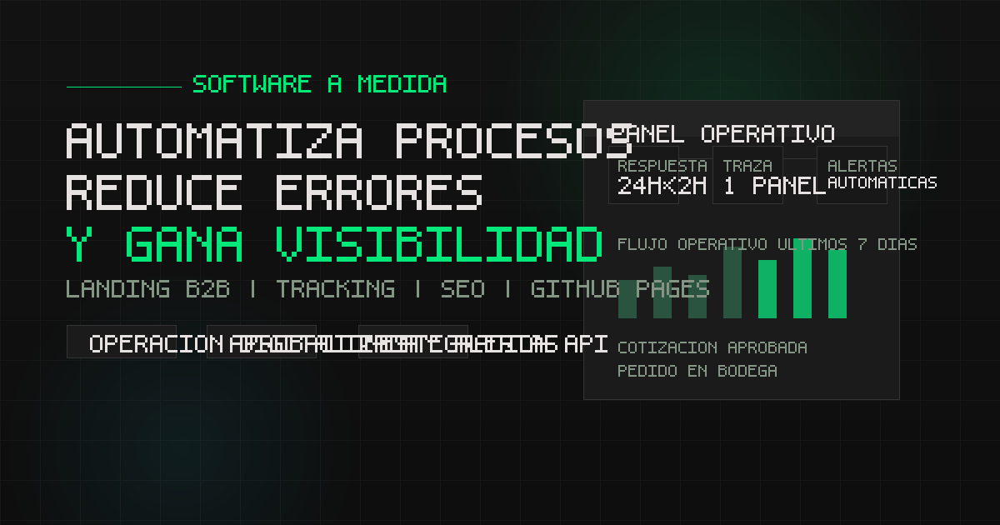

# nandoc.dev

Landing estática para servicios de automatización de procesos y software a medida, optimizada para GitHub Pages.



## Stack

- HTML semántico
- CSS vanilla
- JavaScript vanilla
- SVG sprite inline
- GitHub Pages

## Estructura

```text
assets/
  css/
  fonts/
  img/
  js/
index.html
README.md
```

## Decisiones actuales

- Sin framework UI ni build step.
- Tipografías self-hosted para evitar dependencias de Google Fonts.
- SEO base resuelto en `index.html` con canonical, Open Graph y JSON-LD.
- Tracking mínimo con Google Analytics para CTAs, scroll depth y vistas de secciones.
- Configuración repetida de contacto centralizada en `#site-config`.

## Analytics instrumentado

Eventos enviados con `gtag`:

- `cta_click`
- `section_view`
- `scroll_depth`

Los CTAs separan:

- `location`
- `channel`
- `intent`

## Assets locales

- Preview social: `assets/img/og-image.png`
- Favicon: `assets/img/icons/favicon.svg`
- Tipografías: `assets/fonts/`

## Deploy

El sitio se publica como página estática en GitHub Pages desde la raíz del repositorio.
